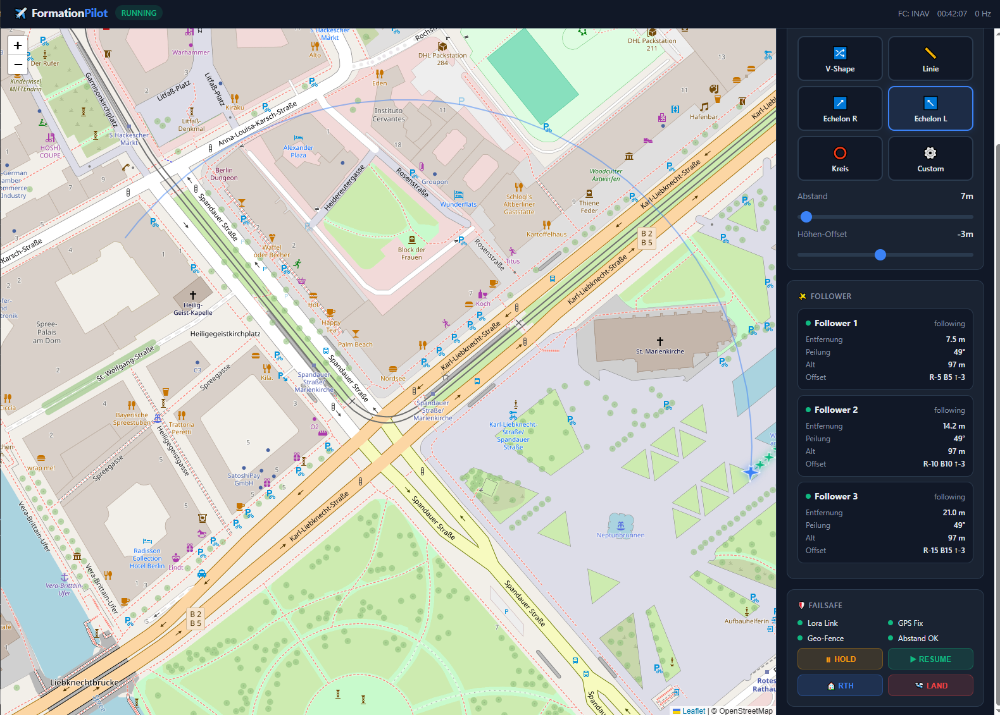
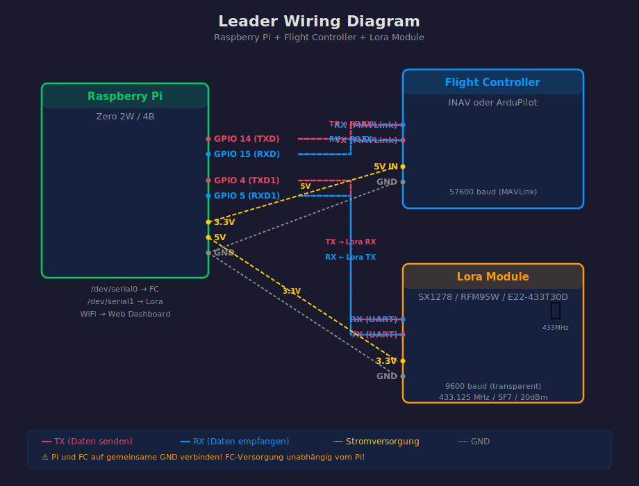
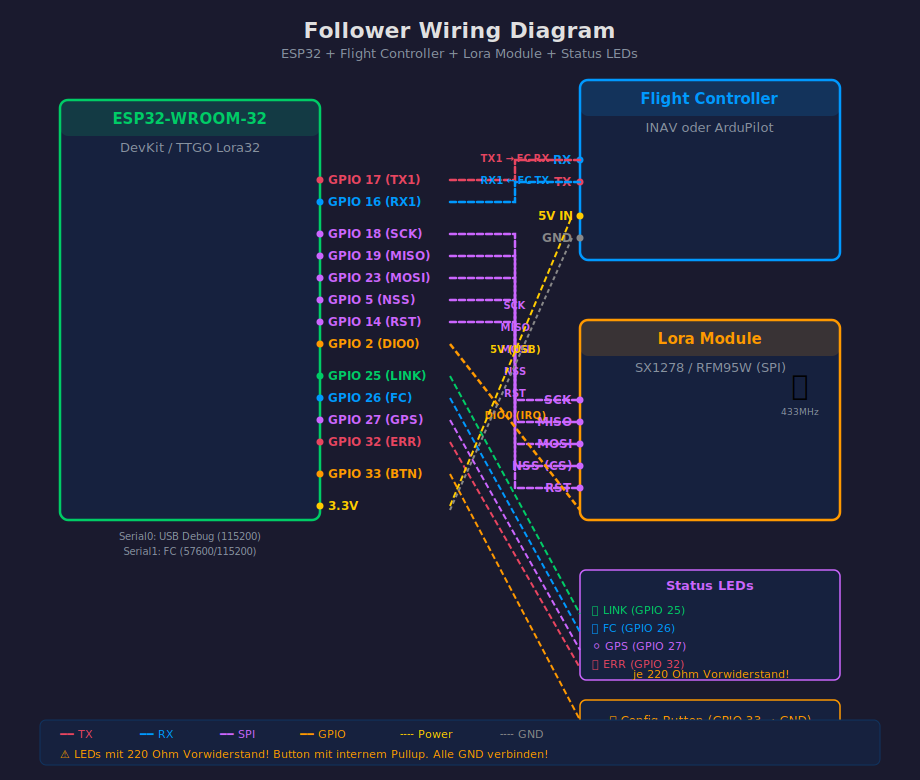

<div align="center">

# ✈️ FormationPilot

### Platform-Agnostic Formation Flight Engine for INAV & ArduPilot

**Leader-Follower Formationsflug-System** mit Lora-Funkverbindung und Live-Web-Dashboard

*by aeroFun Fpv Ingo Ruddat*

[](LICENSE)
[](https://python.org)
[](https://platformio.org)
[](https://github.com/iNavFlight/inav)
[](https://ardupilot.org)

[Features](#-features) • [Quick Start](#-quick-start) • [Wiring](#-wiring-diagrams) • [Dashboard](#-web-dashboard) • [Firmware](#-esp32-follower-firmware) • [Protocol](#-lora-protokoll)

</div>

---



---

## Wie es funktioniert

Der Leader fliegt normal, die Follower empfangen ihre Zielposition per 433MHz Lora-Funk und folgen automatisch in wählbarer Formation. Ein Live-Dashboard auf dem Raspberry Pi zeigt alle Flugzeuge auf der Karte und ermöglicht Formation-Wechsel im Flug.

```
┌──────────────────────────────────────────────┐
│              LEADER (Flugzeug 1)              │
│  ┌──────────┐  ┌──────────────┐  ┌────────┐ │
│  │ INAV oder │─>│ Raspberry Pi │─>│  Lora  │ │
│  │ArduPilot  │  │ Formation    │  │ Sender │ │
│  │   FC      │  │ Engine       │  │        │ │
│  └──────────┘  │  + Web UI    │  └───┬────┘ │
│                └──────────────┘      │      │
└─────────────────────────────────────┼──────┘
                                      │ Lora 433MHz
           ┌──────────────────────────┼──────────────┐
           ▼                          ▼              ▼
    ┌─────────────┐          ┌─────────────┐  ┌─────────────┐
    │  FOLLOWER 1  │          │  FOLLOWER 2  │  │  FOLLOWER 3  │
    │  ESP32+Lora  │          │  ESP32+Lora  │  │  ESP32+Lora  │
    │  ──> INAV FC │          │  ──> AP FC   │  │  ──> INAV FC │
    └─────────────┘          └─────────────┘  └─────────────┘

    📱 Handy/Laptop ── WiFi ──> Pi Web Dashboard (Port 5000)
```

## ✨ Features

| Kategorie | Feature |
|-----------|---------|
| **FC Support** | INAV + ArduPilot – Auto-Detection der FC-Firmware |
| **Formationen** | 6 Typen: V-Shape, Line, Echelon L/R, Circle, Custom |
| **Funkverbindung** | Lora 433MHz – Bis 3km (SF7), 10km (SF12) |
| **Protokoll** | Kompakt: ~54 Bytes für Leader + 3 Follower |
| **Failsafe** | Link-Lost → RTH, Geo-Fence, Min/Max-Distanz |
| **Runtime** | Formationstyp im Flug änderbar |
| **Protokolle** | MAVLink für Position, MSP für INAV-Befehle |
| **Dashboard** | Live-Karte mit Flugzeug-Icons, Formation-Controls, Failsafe-Status |
| **Demo** | Interaktiver Modus – Ohne Hardware testbar |

## 🚀 Quick Start

### 1. Projekt klonen

```bash
git clone https://github.com/Ruddat/FormationPilot.git
cd FormationPilot
```

### 2. Abhängigkeiten installieren

```bash
python -m venv venv
# Windows
.\venv\Scripts\activate
# Mac/Linux
source venv/bin/activate
pip install -r requirements.txt
```

### 3. Web-Demo starten 🎮

```bash
python main.py --web
```

Dann Browser auf **http://localhost:5000** – du siehst:
- 🗺️ Live-Karte mit animierten Flugzeug-Icons (Leader fliegt Kreis)
- ✈️ 3 Follower in Formation mit gestrichelten Verbindungslinien
- 🔀 Formation-Typ live wechselbar (V-Shape, Line, Echelon, Kreis)
- 🎚️ Spacing und Höhen-Offset per Slider einstellbar
- 🛡️ Failsafe-Status und Notfall-Buttons (HOLD, RTH, LAND)

### 4. Terminal-Demo (alternativ)

```bash
python main.py --demo
```

Tastatursteuerung: `[1]`-`[6]` Formation | `[+]`/`[-]` Spacing | `[a]`/`[z]` Höhe | `[q]` Beenden

### 5. Echter Flugbetrieb (Raspberry Pi)

1. **Hardware verkabeln** – Siehe [Wiring Diagrams](#wiring-diagrams)
2. **Konfiguration anpassen:** `nano config.yaml`
3. **Engine starten:** `python3 main.py config.yaml`
4. **Dashboard öffnen:** Handy-Browser → `http://<pi-ip>:5000`

## 📊 Web Dashboard

Das Dashboard läuft auf dem Pi und ist von jedem Gerät im WLAN erreichbar:

| Feature | Beschreibung |
|---------|-------------|
| 🗺️ **Live-Karte** | Leaflet.js mit Flugzeug-SVG-Icons, Heading-Rotation, Trail |
| 🔀 **Formation-Selector** | 6 Formationen per Klick wechseln |
| 🎚️ **Spacing-Slider** | 5m bis 100m Abstand einstellbar |
| 🎚️ **Höhen-Offset** | ±50m Höhenversatz |
| 🛩️ **Follower-Cards** | Distanz, Peilung, Offset pro Follower |
| 🛡️ **Failsafe-Status** | Lora, GPS, Geo-Fence, Abstand |
| 🚨 **Notfall-Buttons** | HOLD, RTH, LAND, RESUME |
| 📱 **Responsive** | Dark Theme, Handy-tauglich |
| ⚡ **Real-Time** | WebSocket Updates (5Hz) |

## 🔌 Wiring Diagrams

> **Interaktive Version:** [docs/wiring.html](docs/wiring.html) – Im Browser öffnen für Fritzing-Style SVGs mit Pin-Tabellen und BOM!

### Leader (Raspberry Pi)



| Verbindung | Pi Pin | FC / Lora Pin | Kabel |
|-----------|--------|---------------|-------|
| MAVLink TX | GPIO 14 (TXD) | FC RX | 🔴 Rot |
| MAVLink RX | GPIO 15 (RXD) | FC TX | 🔵 Blau |
| Lora TX | GPIO 4 (TXD1) | Lora RX | 🟣 Lila |
| Lora RX | GPIO 5 (RXD1) | Lora TX | 🟣 Lila |
| Lora Power | 3.3V | Lora VCC | 🟡 Gelb |
| GND | GND | Lora + FC GND | ⚪ Grau |

### Follower (ESP32)



| Gruppe | Verbindung | ESP32 Pin | Ziel | Kabel |
|--------|-----------|-----------|------|-------|
| **SPI** | Lora SCK | GPIO 18 | SX1278 SCK | 🟣 Lila |
| | Lora MISO | GPIO 19 | SX1278 MISO | 🟣 Lila |
| | Lora MOSI | GPIO 23 | SX1278 MOSI | 🟣 Lila |
| | Lora NSS | GPIO 5 | SX1278 CS | 🟣 Lila |
| | Lora RST | GPIO 14 | SX1278 RST | 🟣 Lila |
| | Lora IRQ | GPIO 2 | SX1278 DIO0 | 🟠 Orange |
| **UART1** | FC TX | GPIO 17 | FC RX | 🔴 Rot |
| | FC RX | GPIO 16 | FC TX | 🔵 Blau |
| **LEDs** | LINK | GPIO 25 | LED Grün + 220Ω | 🟢 Grün |
| | FC | GPIO 26 | LED Blau + 220Ω | 🔵 Blau |
| | GPS | GPIO 27 | LED Weiß + 220Ω | ⚪ Weiß |
| | ERR | GPIO 32 | LED Rot + 220Ω | 🔴 Rot |
| **Config** | Button | GPIO 33 | Taste → GND | 🟠 Orange |

## 🔀 Formationstypen

### V-Shape (Standard)
```
    F2          F1
      \       /
       \     /
        LEADER
          |
         F3
```

### Line / Echelon / Circle
```
Line:          Echelon R:       Circle:
  LEADER         LEADER          F2
    |               F1        F3    F1
   F1                 F2     LEADER
    |                   F3       F4
   F2
    |
   F3
```

### Custom
Frei definierbare Offsets pro Follower in `config.yaml`:
```yaml
followers:
  - id: 1
    offset_right: 20    # Meter rechts (negativ = links)
    offset_behind: 5     # Meter hinter (negativ = vor)
    offset_above: 0      # Meter über (negativ = unter)
```

## 📡 Lora Protokoll

### Paketstruktur
```
┌──────┬──────┬──────┬──────┬─────────┬──────┐
│ 0xAA │ TYPE │ SEQ  │ LEN  │ PAYLOAD │ CRC8 │
│  1B  │  1B  │  1B  │  1B  │ var     │  1B  │
└──────┴──────┴──────┴──────┴─────────┴──────┘
```

### Position Encoding
| Feld | Encoding | Bereich | Präzision |
|------|----------|---------|-----------|
| Lat/Lon | deg × 1e7 (int32) | ±180° | ~1cm |
| Alt | dm (uint16) | 0-6553m | 10cm |
| Heading | cdeg (uint16) | 0-360° | 0.01° |
| Speed | dm/s (uint8) | 0-25.5 m/s | 0.1 m/s |

**Total: 54 Bytes** für Leader + 3 Follower (passt in ein Lora-Paket)

## 🛡️ Failsafe System

| Bedingung | Schwellwert | Aktion |
|-----------|-------------|--------|
| Lora-Link verloren | 3s | **RTH** |
| Position veraltet | 2s | **HOLD** |
| Follower zu weit | 100m | **HOLD** |
| Follower zu nah | 10m | **WARN** |
| Geo-Fence verletzt | 500m | **RTH** |
| Leader zu schnell | 25 m/s | **WARN** |
| GPS schwach | <6 Sats | **WARN** |

> ⚠️ Die FC-eigenen Failsafes (RTH, GPS-Failsafe) greifen IMMER zusätzlich und haben Priorität!

## ⚙️ FC Konfiguration

### INAV
1. **MAVLink aktivieren:** CLI `serial X 2 115200 57600 0 115200` oder Configurator → Serial → MAVLink
2. **Navigation:** WP Mode aktivieren, GPS 3D-Fix erforderlich, RTH als Failsafe
3. **Failsafe:** Failsafe → RTH (nicht DROP oder LAND)

### ArduPilot
1. **MAVLink aktivieren:** `SERIALX_PROTOCOL = 1/2`, `SERIALX_BAUD = 57`
2. **NAV/RTL:** RTL als Failsafe-Action, GPS → 3D Fix erforderlich

## 🤖 ESP32 Follower Firmware

Die Firmware läuft auf jedem Follower-Modul (ESP32 + SX1278 Lora) und empfängt
Formation-Positionsdaten vom Leader. Sie extrahiert die eigene Zielposition,
sendet Navigationskommandos an den Flight Controller und überwacht die Verbindungsqualität.

### State Machine
```
INIT ──> WAITING_LINK ──> FORMATION <──> HOLD
              |               |    |         |
              v               v    v         v
           FAILSAFE         RTH  LAND    (CMD_RESUME)
```

### Firmware bauen und flashen

```bash
pip install platformio
cd firmware
pio run                  # Kompilieren
pio run --target upload  # Auf ESP32 flashen
pio device monitor       # Serial Monitor
```

### NVS Konfiguration

| Key | Default | Beschreibung |
|-----|---------|-------------|
| `f_id` | 1 | Follower ID (1-255) |
| `fc_type` | 0 (auto) | FC Typ: 0=Auto, 1=INAV, 2=ArduPilot |
| `l_freq` | 433125 | Lora Frequenz (433.125 MHz) |
| `l_sf` | 7 | Spreading Factor (7-12) |
| `l_pwr` | 20 | TX Power (dBm) |
| `fc_baud` | 57600 | FC Baudrate |

Config-Modus: Beim Start GPIO 33 (Config-Button) gedrückt halten.

## 💰 Hardware-Kosten

| Rolle | Komponenten | Preis |
|-------|------------|-------|
| **Leader** | Raspberry Pi Zero 2W + Lora SX1278 + Kabel | ~34 EUR |
| **Follower** | TTGO Lora32 V2.1 (ESP32+Lora integriert) | ~15 EUR |
| **4er-Team** | 1x Leader + 3x Follower | **~79 EUR** |

## 🗂️ Projektstruktur

```
FormationPilot/
├── main.py                     # Entry Point (Demo + Web + Engine)
├── config.yaml                 # Konfiguration
├── requirements.txt            # Python Dependencies
├── formation/                  # Python Leader-Engine
│   ├── formations.py           # Formation Calculator
│   ├── mavlink_adapter.py      # MAVLink Kommunikation
│   ├── msp_adapter.py          # MSP Kommunikation (INAV)
│   ├── fc_adapter.py           # Unified FC Interface + Auto-Detection
│   ├── lora_broadcaster.py     # Lora Funkprotokoll
│   ├── failsafe.py             # Failsafe Manager
│   └── formation_engine.py     # Main Engine
├── web/                        # Web Dashboard
│   ├── __init__.py             # Flask Web App + API
│   └── templates/index.html   # Dashboard (Karte + Controls)
└── firmware/                   # ESP32 Follower Firmware
    ├── platformio.ini          # PlatformIO Konfiguration
    ├── include/                # Header (config, protocol, drivers)
    └── src/                    # Source (main, lora, fc, failsafe, led, nvs)
```

## 🔌 API Endpunkte

| Endpoint | Methode | Beschreibung |
|----------|---------|-------------|
| `/api/state` | GET | Aktueller Formation-Status |
| `/api/formations` | GET | Verfügbare Formationstypen |
| `/api/formation/change` | POST | Formation wechseln |
| `/api/follower/<id>/command` | POST | Befehl an Follower |
| `/api/failsafe/rules` | GET | Failsafe-Regeln |
| `/api/config` | GET | Aktuelle Konfiguration |

WebSocket Events: `state_update`, `formation_changed`

## 📋 Roadmap

- [x] ESP32 Follower Firmware – PlatformIO Projekt mit State Machine
- [x] Wiring Diagrams – Interaktive Fritzing-Style Pläne ([wiring.html](docs/wiring.html))
- [x] Web Dashboard – Live-Karte mit Formation-Controls
- [ ] Integrationstests – Mit realen INAV/AP Flight Controllern
- [ ] Lora Module Konfiguration – AT-Command Setup automatisieren
- [ ] Serial Config Interface – ESP32 Konfiguration per UART
- [ ] RSSI-basierte Reichweitenwarnung – Signalqualität im Dashboard
- [ ] OTA Updates – Firmware-Update über WiFi
- [ ] Video-Tutorial – Setup und Erstflug-Doku

## 📄 Lizenz

MIT License – Frei nutzbar und modifizierbar.

---

<div align="center">

**[⬆ Nach oben](#-formationpilot)**

Made with ✈️ by aeroFun Fpv Ingo Ruddat

</div>
